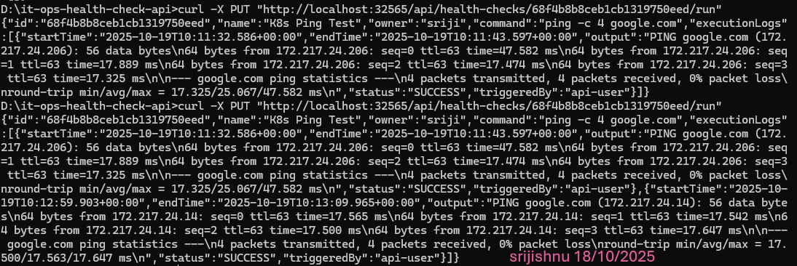

 Kaiburr Assessment - Task 2: Kubernetes Deployment & Cloud-Native Execution

This repository contains the complete solution for **Task 2 of the Kaiburr Technical Assessment**.  
It takes the **Java REST API from Task 1**, containerizes it, and deploys it to a **Kubernetes cluster**, transforming it into a **secure, cloud-native application**.


 Overview

The core of this task is implementing a **secure, dynamic execution model** where shell commands are executed inside **temporary, isolated pods** that the application creates and manages programmatically.

This project demonstrates not just functionality but **enterprise-grade cloud-native design**, showcasing best practices for:
- Security
- Resource lifecycle management
- Stateful data persistence
- Declarative infrastructure (GitOps-ready)


 Key Features & Professional Cloud-Native Approach

 True Cloud-Native Execution Model
Instead of running shell commands on the main server (a major security risk), the application uses the **Kubernetes Java Client** to:
- Dynamically create **ephemeral Jobs**.
- Run each command in a **temporary busybox container**.
- Retrieve logs securely.
- Automatically delete the Job and Pod after completion.

Each command runs in complete isolation — ensuring maximum security.


 Automated Resource Lifecycle Management
The application handles the **entire lifecycle** of Kubernetes Jobs:
- Creates resources on-demand.
- Fetches results (logs).
- Cleans up automatically after execution.
  
This prevents resource leaks and maintains a clean cluster — following the principles of **operational excellence**.


 Persistent Data Storage
MongoDB runs with a **PersistentVolumeClaim (PVC)**, guaranteeing data survives:
- Pod restarts
- Node failures
- Application redeployments

This ensures **stateful reliability** in a cloud environment.


 Declarative Infrastructure (GitOps Ready)
All Kubernetes resources — including:
- Namespace  
- Deployments  
- Services  
- Roles / ServiceAccounts  
- PersistentVolumeClaims  

are defined inside the [`k8s/`](./k8s) directory as YAML manifests.  
This makes the setup **fully reproducible**, version-controlled, and **GitOps compliant**.


  Secure by Design
Follows the **Principle of Least Privilege**:
- Runs under a dedicated **ServiceAccount**.
- Role-based permissions only allow creating, viewing, and deleting Jobs and reading Pod logs.
- All actions restricted to the application’s namespace.


  Live Demonstration of Kubernetes Functionality

Add your **screenshots** under a folder named `images/` and link them below.


 1. Successful Deployment

**Command:**
```bash
kubectl get all -n health-checks
```

**Result Screenshot:**


 2.  Create a Task via the API

**Command:**
```bash
 Replace <NODE_PORT> with the port from 'kubectl get all'
curl -X PUT "http://localhost:<NODE_PORT>/api/health-checks"   -H "Content-Type: application/json"   -d '{ "name": "K8s Ping Test", "owner": "sriji", "command": "ping -c 4 google.com" }'
```

**Result Screenshot:**


 3.  Run the Task & Verify Execution

**Commands:**
```bash
 Run the task (replace <NODE_PORT> and <ID>)
curl -X PUT "http://localhost:<NODE_PORT>/api/health-checks/<YOUR_ID_HERE>/run"

 Wait ~20 seconds, then get the results
curl "http://localhost:<NODE_PORT>/api/health-checks/<YOUR_ID_HERE>"
```

**Result Screenshot:**



  Local Deployment & Running Instructions (Optional)

For reviewers who wish to replicate the full Kubernetes deployment locally.

 Prerequisites
- **Java JDK 21**
- **Apache Maven 3.9+**
- **Docker Desktop (with Kubernetes enabled)**


  Steps to Deploy

1. **Clone the repository**
   ```bash
   git clone <your-repo-url>
   cd it-ops-health-check-api
   ```

2. **Build the application JAR**
   ```bash
   mvn clean package
   ```

3. **Build the Docker image**
   ```bash
   docker build -t it-ops-health-check-api:v1 .
   ```

4. **Update deployment manifest**
   - Open `k8s/api-deployment.yaml`
   - Ensure:
     ```yaml
     image: it-ops-health-check-api:v1
     imagePullPolicy: Never
     ```

5. **Apply all Kubernetes manifests**
   ```bash
   kubectl apply -f k8s/
   ```

6. **Check deployment status**
   ```bash
   kubectl get all -n health-checks
   ```


 Project Structure

```
it-ops-health-check-api/
├── Dockerfile
├── pom.xml
├── k8s/
│   ├── api-deployment.yaml
│   ├── api-service.yaml
│   ├── mongodb.yaml
│   ├── namespace.yaml
│   └── role.yaml
└── src/
    └── main/java/com/example/itopshealthcheck/
        ├── controller/
        ├── service/
        ├── repository/
        └── model/
```


 License
This project is created as part of the **Kaiburr Technical Assessment**.  
You may view, clone, and use it for **educational or review purposes**.
